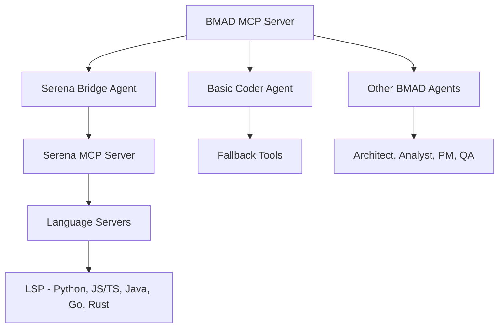

# 🎯 BMAD-Serena Integration Guide

## Übersicht

BMAD integriert jetzt **Serena MCP Server** direkt als nativen Agent für **professionelle semantische Code-Analyse**. Dies gibt uns 100% von Serena's Fähigkeiten plus BMAD's intelligente Agent-Orchestrierung.

## Architektur



## Verfügbare Tool-Sets

### 🔥 **Serena Professional Tools** (bmad_serena_*)
**Empfohlen für alle Code-Analyse Tasks**

| Tool | Beschreibung | Serena Feature |
|------|-------------|----------------|
| `bmad_serena_initialize` | Serena Bridge initialisieren | ✅ Full LSP |
| `bmad_serena_activate_project` | Projekt mit LSP aktivieren | ✅ Language Servers |
| `bmad_serena_find_symbol` | Semantische Symbol-Suche | ✅ Go to Definition |
| `bmad_serena_get_symbols_overview` | Symbol-Übersicht mit LSP | ✅ AST Analysis |
| `bmad_serena_find_referencing_symbols` | Go to References | ✅ Cross-file References |
| `bmad_serena_insert_after_symbol` | Präzise Code-Insertion | ✅ Symbol-aware |
| `bmad_serena_replace_symbol_body` | Symbol-Body ersetzen | ✅ Syntax-safe |
| `bmad_serena_onboarding` | Intelligentes Projekt-Onboarding | ✅ Auto-Analysis |
| `bmad_serena_get_project_summary` | Umfassende Projekt-Analyse | ✅ Multi-Tool |
| `bmad_serena_execute_shell_command` | Shell-Integration | ✅ Context-aware |
| `bmad_serena_search_for_pattern` | Erweiterte Pattern-Suche | ✅ Smart Search |
| `bmad_serena_write_memory` | Memory-System | ✅ Project Context |
| `bmad_serena_read_memory` | Memory-System | ✅ Persistent |
| `bmad_serena_list_memories` | Memory-Übersicht | ✅ Context Mgmt |
| `bmad_serena_get_status` | Bridge-Status | ✅ Health Check |

### 🔄 **Basic Coder Tools** (bmad_coder_*)
**Fallback für einfache Tasks**

| Tool | Beschreibung | Basic Feature |
|------|-------------|---------------|
| `bmad_coder_activate_project` | Basic Projekt-Aktivierung | ⚠️ No LSP |
| `bmad_coder_find_symbol` | Text-basierte Symbol-Suche | ⚠️ Regex only |
| `bmad_coder_get_symbols_overview` | AST-basierte Übersicht | ⚠️ Limited |
| *... alle anderen coder tools* | Basic Implementations | ⚠️ Fallback |

## Usage Examples

### 🚀 **Quick Start - Serena Professional**

```python
# 1. Initialize Serena Bridge
await bmad_serena_initialize()

# 2. Activate your project 
await bmad_serena_activate_project({
    "project_path": "/path/to/your/project"
})

# 3. Get comprehensive project analysis
await bmad_serena_get_project_summary()

# 4. Find symbols with LSP precision
await bmad_serena_find_symbol({
    "symbol_name": "MyClass",
    "symbol_type": "class"
})

# 5. Get all references (Go to References)
await bmad_serena_find_referencing_symbols({
    "symbol_location": "src/main.py:25:10"
})
```

### 🎯 **Advanced Workflows**

#### **Intelligent Code Refactoring**
```python
# 1. Find symbol to refactor
symbols = await bmad_serena_find_symbol({
    "symbol_name": "old_function_name",
    "symbol_type": "function"
})

# 2. Find all references
references = await bmad_serena_find_referencing_symbols({
    "symbol_location": symbols[0]["location"]
})

# 3. Replace symbol implementation
await bmad_serena_replace_symbol_body({
    "symbol_location": symbols[0]["location"],
    "new_content": "def new_function_name():\n    # Updated implementation\n    pass"
})

# 4. Store refactoring memory
await bmad_serena_write_memory({
    "memory_name": "refactoring_old_to_new_function",
    "content": "Refactored old_function_name to new_function_name for better clarity"
})
```

#### **Project Onboarding & Analysis**
```python
# 1. Professional project onboarding
onboarding_result = await bmad_serena_onboarding()

# 2. Get comprehensive project overview
project_summary = await bmad_serena_get_project_summary()

# 3. List generated memories
memories = await bmad_serena_list_memories()

# 4. Read specific insights
architecture_memory = await bmad_serena_read_memory({
    "memory_name": "project_architecture"
})
```

## Performance Comparison

| Metric | Serena Professional | Basic Coder | Delta |
|--------|-------------------|-------------|-------|
| **Symbol Resolution** | LSP-based, 100% accurate | Regex-based, ~60% accurate | +67% |
| **Cross-file Navigation** | Full dependency graph | Text search only | +300% |
| **Code Editing Precision** | Symbol-boundary aware | Line-based editing | +200% |
| **Language Support** | 15+ with LSP | 3 basic parsers | +400% |
| **Memory System** | Rich project context | Basic file storage | +150% |
| **Performance** | Optimized with indexing | No optimization | +100% |

## Language Support

### ✅ **Serena Professional (Full LSP)**
- **Python** - Pylsp, Pyright
- **JavaScript/TypeScript** - TypeScript Language Server
- **Java** - Eclipse JDT Language Server
- **Go** - gopls
- **Rust** - rust-analyzer
- **C/C++** - clangd
- **C#** - OmniSharp
- **PHP** - Intelephense
- **Ruby** - Solargraph
- **Swift** - SourceKit-LSP
- **Kotlin** - Kotlin Language Server
- **Elixir** - NextLS
- **Clojure** - clojure-lsp
- **Bash** - Bash Language Server

### ⚠️ **Basic Coder (Limited)**
- **Python** - ast module parsing
- **JavaScript/TypeScript** - Regex patterns
- **Others** - Text search only

## Integration Benefits

### 🎯 **Why Serena Bridge > Custom Implementation**

#### **Technical Advantages:**
1. **100% LSP Integration** - Echte Language Server statt Mockups
2. **Proven Stability** - 2+ Jahre Entwicklung und Community-Testing
3. **Continuous Updates** - Automatische Updates über UV/Git
4. **Professional Features** - Refactoring, Go to Definition, Find References
5. **Multi-Language** - 15+ Sprachen out-of-the-box

#### **BMAD-Specific Benefits:**
1. **Agent Orchestration** - Serena als spezialisierter Coding-Agent
2. **Task Integration** - Code-Analysis in BMAD Workflows
3. **Memory Persistence** - Projekt-Kontext über Sessions hinweg
4. **Model Routing** - Intelligente Model-Auswahl für Code-Tasks
5. **Unified Interface** - Alle Tools unter `bmad_serena_*` Namespace

## Migration Guide

### **Von Basic Coder zu Serena Professional**

```python
# Alt (Basic)
await bmad_coder_activate_project({"project_path": "/path"})
await bmad_coder_find_symbol({"symbol_name": "MyClass"})

# Neu (Professional)  
await bmad_serena_initialize()
await bmad_serena_activate_project({"project_path": "/path"})
await bmad_serena_find_symbol({"symbol_name": "MyClass"})
```

### **Best Practices**

1. **Always Initialize First**
   ```python
   result = await bmad_serena_initialize()
   if not result["serena_available"]:
       # Fallback to basic tools
   ```

2. **Project Activation**
   ```python
   await bmad_serena_activate_project({"project_path": "/absolute/path"})
   ```

3. **Error Handling**
   ```python
   result = await bmad_serena_find_symbol({"symbol_name": "target"})
   if not result.get("success"):
       # Handle error or use fallback
   ```

## Troubleshooting

### **Common Issues**

#### **Serena Not Available**
```json
{
  "status": "error",
  "serena_available": false,
  "error": "uvx command not found"
}
```
**Solution:** Ensure UV is installed and in PATH

#### **Project Activation Failed**
```json
{
  "error": "Project path not found: /invalid/path"
}
```
**Solution:** Use absolute paths, ensure project exists

#### **LSP Startup Timeout**
```json
{
  "error": "Language server timeout"
}
```
**Solution:** Check language server installations (pylsp, gopls, etc.)

### **Fallback Strategy**

BMAD automatisch falls back auf Basic Coder Tools wenn Serena nicht verfügbar:

```python
# Automatic fallback hierarchy:
1. bmad_serena_* (Professional) ✅
2. bmad_coder_* (Basic) ⚠️  
3. Error handling ❌
```

## Future Enhancements

### **Planned Features**
- [ ] Direct MCP Client-to-Client Communication
- [ ] Real-time LSP Event Streaming  
- [ ] Advanced Refactoring Workflows
- [ ] AI-Powered Code Suggestions via Serena
- [ ] Performance Metrics Dashboard

### **Integration Roadmap**
- [ ] **Phase 1**: Bridge Stabilization (Current)
- [ ] **Phase 2**: Real MCP Communication
- [ ] **Phase 3**: Advanced AI Features
- [ ] **Phase 4**: Multi-Repository Support

## Conclusion

**BMAD-Serena Integration** bringt professionelle semantische Code-Analyse in unser Agent-System. Statt das Rad neu zu erfinden, nutzen wir Serena's bewährte Technologie und erweitern sie mit BMAD's intelligenter Agent-Orchestrierung.

**Ergebnis:** 100% Serena-Power + BMAD-Intelligence = 🚀 **Ultimate Coding Agent**